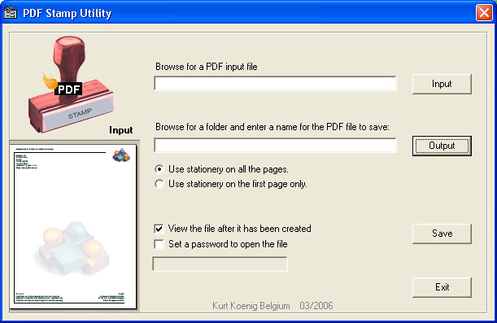



## PDF Stamp Utility

### Description

I hesitated a while before making this program public because it depends on a commercial ActiveX component. But since there isn't so much to find about PDF creation on this site, AND you can download a free trial version of this Activex component I decided to post it. This program adds a stationery stamp (or watermark) to a pdf file. The stamp is just another pdf file. A stationery pdf example is included. You can replace this with your own company's stationery, but if your going to use this for real then you have to purchase a license for the ActivePDF Toolkit component.

The installation of the free Adobe Reader 7 is also required for this program to work (the Acropdf.dll is used in my program by the thumbnail window)

So first get and install the trial from ActivePDF Toolkit http://www.activepdf.com. And secondly, have Acrobat Reader 7 installed. I think this utility is worth the effort. For example: you can use a pdf printer, lot's of them are out there for free, to print pdf's from any program and then use these pdf's as input files to background stamp with your company's stationery. And there's also a lot more you can do with the Activex component. A manual with al methods and properties for that is included when you install the components trial version.

THE INPUT FILE YOU USE MUST HAVE A TRANSPARENT BACKGROUND. USE THE INPUT EXAMPLE IN THIS PROGRAM'S FOLDER IF YOU CAN'T FIND ONE. (when you print a pdf from Word or Excel the background is always transparent)

A folder with two images and and a vbscript file to create a new stationery pdf page is also included in this example.
 
### More Info
 

             |
---                |---
**Submitted On**   |2006-04-01 02:22:32
**By**             |[Kurt Koenig](https://github.com/Planet-Source-Code/PSCIndex/blob/master/ByAuthor/kurt-koenig.md)
**Level**          |Intermediate
**User Rating**    |5.0 (10 globes from 2 users)
**Compatibility**  |VB 5\.0, VB 6\.0, VB Script
**Category**       |[Miscellaneous](https://github.com/Planet-Source-Code/PSCIndex/blob/master/ByCategory/miscellaneous__1-1.md)
**World**          |[Visual Basic](https://github.com/Planet-Source-Code/PSCIndex/blob/master/ByWorld/visual-basic.md)
**Archive File**   |[PDF\_Stamp\_198448412006\.zip](https://github.com/Planet-Source-Code/kurt-koenig-pdf-stamp-utility__1-64870/archive/master.zip)

